# Production-Ready Azure Platform on AKS

> An end-to-end Azure Platform Engineering project demonstrating Infrastructure as Code, Kubernetes, GitOps, CI/CD, secure secret management, autoscaling and full-stack observability.


---

## Project Overview

This project builds and operates a production-inspired application platform on Microsoft Azure.

Azure infrastructure is provisioned with Terraform, a containerised Flask application is published to Azure Container Registry, and workloads are deployed to Azure Kubernetes Service using Helm and Argo CD.

The platform combines cloud infrastructure, Kubernetes operations, CI/CD automation, GitOps, secure secret delivery, HTTPS ingress, autoscaling and observability into one reproducible engineering project.

### What this project demonstrates

- Azure infrastructure provisioning with Terraform
- Container image build and publication with GitHub Actions
- Container image security scanning with Trivy
- Kubernetes application packaging with Helm
- GitOps continuous delivery with Argo CD
- Azure Key Vault integration
- Managed Identity authentication
- HTTPS ingress with cert-manager
- Horizontal Pod Autoscaling
- Kubernetes health probes and resource controls
- Prometheus metrics collection
- Grafana Kubernetes dashboards
- Azure Application Insights telemetry

---

## Live Platform Evidence

### Application over HTTPS

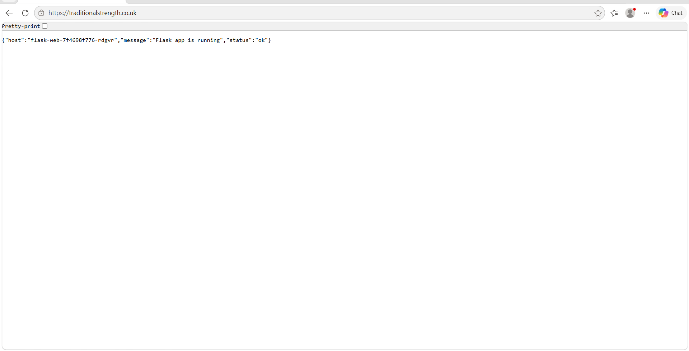

---

## Architecture

```text
Developer
   |
   | git push
   v
GitHub Repository
   |
   v
GitHub Actions
   |
   |-- Build Docker image
   |-- Run Trivy security scan
   |-- Push image to ACR
   |-- Update deployment configuration
   v
Azure Container Registry
   |
   v
Argo CD
   |
   | GitOps reconciliation
   v
Helm Release
   |
   v
Azure Kubernetes Service
   |
   |-- Flask application
   |-- NGINX Ingress
   |-- cert-manager
   |-- Horizontal Pod Autoscaler
   |-- Secrets Store CSI Driver
   |
   +-------------------------------+
   |                               |
   v                               v
Azure Key Vault              Observability Stack
Managed Identity             Prometheus
Application secrets          Grafana
                              Application Insights
```

Detailed architecture documentation is available in [`docs/architecture.md`](docs/architecture.md).

---

## Technology Stack

| Area | Technologies |
|---|---|
| Cloud | Microsoft Azure |
| Infrastructure | Terraform |
| Container Platform | Azure Kubernetes Service |
| Container Registry | Azure Container Registry |
| Application | Python, Flask, Docker |
| Kubernetes Packaging | Helm |
| GitOps | Argo CD |
| CI/CD | GitHub Actions |
| Security Scanning | Trivy |
| Secret Management | Azure Key Vault |
| Authentication | Managed Identity |
| Ingress | NGINX Ingress Controller |
| TLS | cert-manager |
| Autoscaling | Kubernetes Horizontal Pod Autoscaler |
| Metrics | Prometheus |
| Dashboards | Grafana |
| Application Telemetry | Azure Application Insights |

---

## Azure Infrastructure

Terraform provisions the Azure resources required to operate the platform.

The environment includes:

- Azure Kubernetes Service
- Azure Container Registry
- Azure Key Vault
- Azure Application Insights
- Log Analytics Workspace
- Managed identities
- Virtual networking
- Network security controls
- Supporting Azure resources

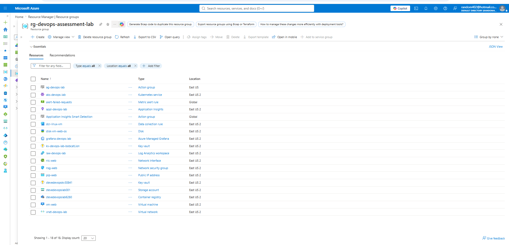

---

## Continuous Integration

GitHub Actions automates application build, validation and publication.

The pipeline performs the following stages:

1. Checks out the repository
2. Builds the Docker image
3. Scans the image with Trivy
4. Authenticates to Azure
5. Pushes the image to Azure Container Registry
6. Updates the required deployment configuration
7. Allows Argo CD to reconcile the new desired state

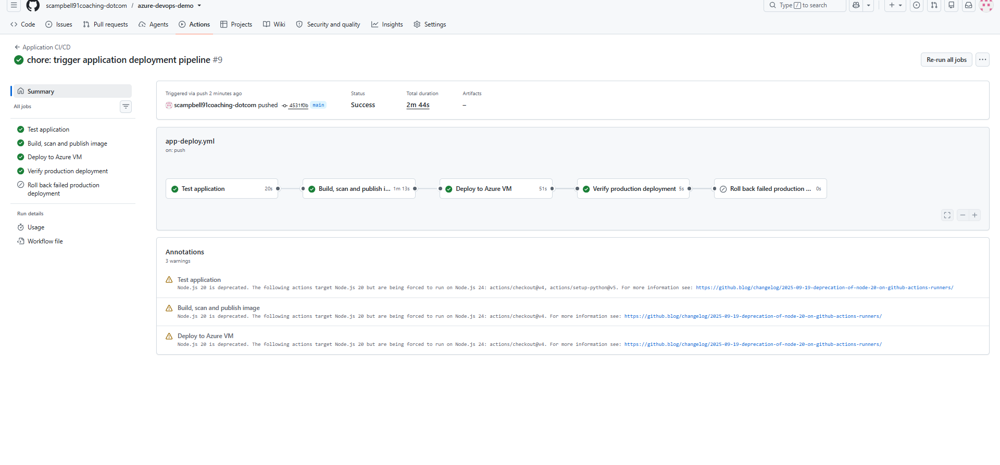

The repository provides a single source for infrastructure, application code, Kubernetes configuration, Helm packaging and delivery automation.

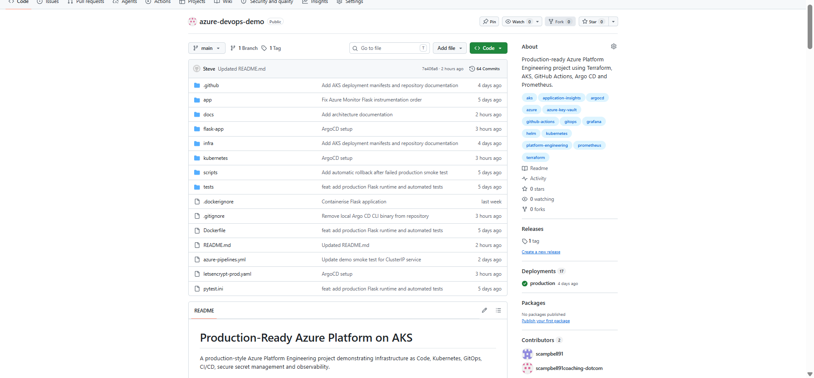

---

## GitOps Continuous Delivery

Argo CD continuously monitors the Git repository and compares the declared Kubernetes configuration with the live AKS environment.

When a deployment change is committed:

1. Git remains the source of truth
2. Argo CD detects the change
3. The Helm release is rendered
4. Kubernetes resources are reconciled
5. Configuration drift is detected and corrected
6. Application health and synchronisation status are exposed through Argo CD

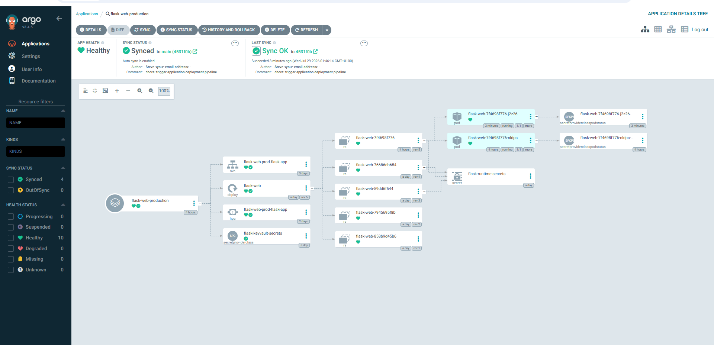

This creates a clear separation between continuous integration and continuous delivery:

```text
GitHub Actions = build, scan and publish
Argo CD        = deploy, reconcile and maintain desired state
```

---

## Kubernetes Platform

The production namespace contains the application deployment, service, ingress and autoscaler.

Platform safeguards include:

- Readiness probes
- Liveness probes
- CPU resource requests
- Memory resource requests
- Resource limits
- Horizontal Pod Autoscaling
- Helm-managed configuration
- Namespace separation
- Ingress routing
- TLS termination

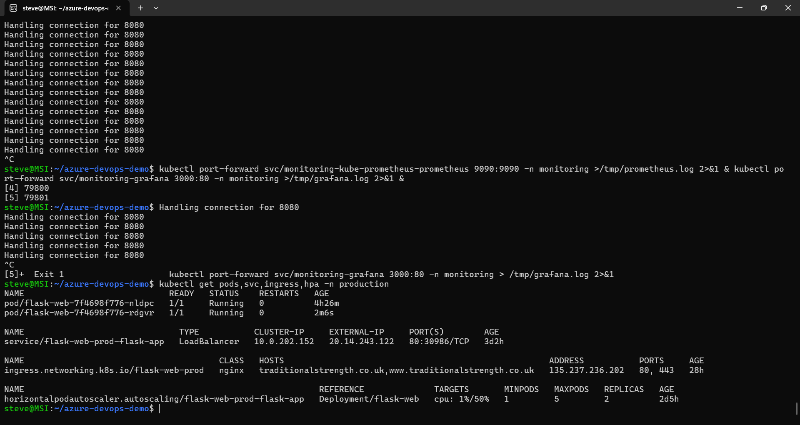

### Validate production resources

```bash
kubectl get pods,svc,ingress,hpa -n production
```

### Validate the deployment

```bash
kubectl get deployment flask-web -n production
```

### Validate Key Vault integration

```bash
kubectl get secretproviderclass -n production
```

### Inspect application pods

```bash
kubectl get pods -n production -o wide
```

---

## Helm Validation

The application is packaged as a Helm chart with environment-specific production values.

### Lint the chart

```bash
helm lint flask-app
```

### Lint production values

```bash
helm lint flask-app \
  -f flask-app/values-production.yaml
```

### Render production manifests

```bash
helm template flask-web-prod flask-app \
  -f flask-app/values-production.yaml
```

---

## Security

Security is implemented across the build, infrastructure and runtime layers.

### Build security

- Trivy container image scanning
- Automated pipeline execution
- Version-controlled deployment configuration
- Reproducible image builds

### Identity and secrets

- Azure Managed Identity
- Azure Key Vault
- Secrets Store CSI Driver
- No application secrets stored directly in source control
- No credentials embedded in container images

### Kubernetes security and resilience

- CPU and memory resource controls
- Readiness probes
- Liveness probes
- Namespace-scoped resources
- Environment-specific Helm values
- Declarative deployment state

### Network security

- HTTPS ingress
- TLS certificates managed by cert-manager
- Azure networking controls
- Network Security Group rules

---

## Observability

The platform provides visibility across infrastructure, Kubernetes and application layers.

```text
Infrastructure layer  -> Azure and AKS resource health
Kubernetes layer      -> Prometheus and Grafana
Application layer     -> Azure Application Insights
```

---

## Grafana

Grafana provides dashboards for cluster, namespace and workload-level visibility.

### Grafana Home

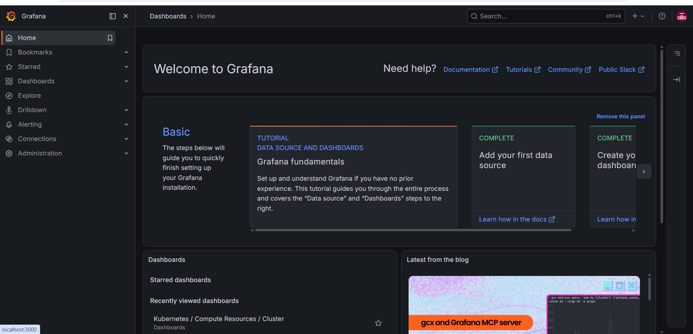

### Kubernetes Cluster Dashboard

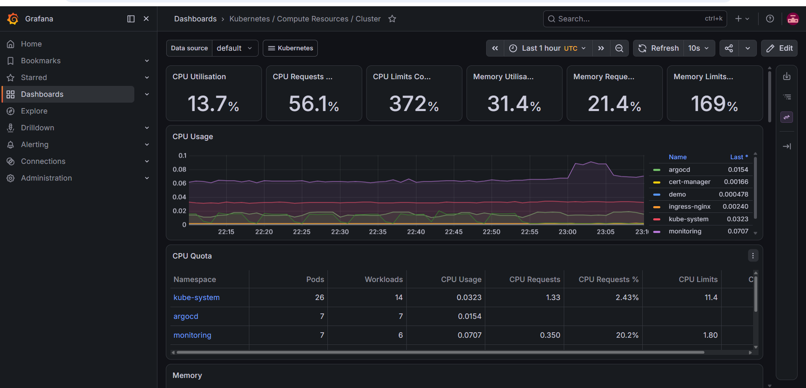

### Kubernetes Namespace Dashboard

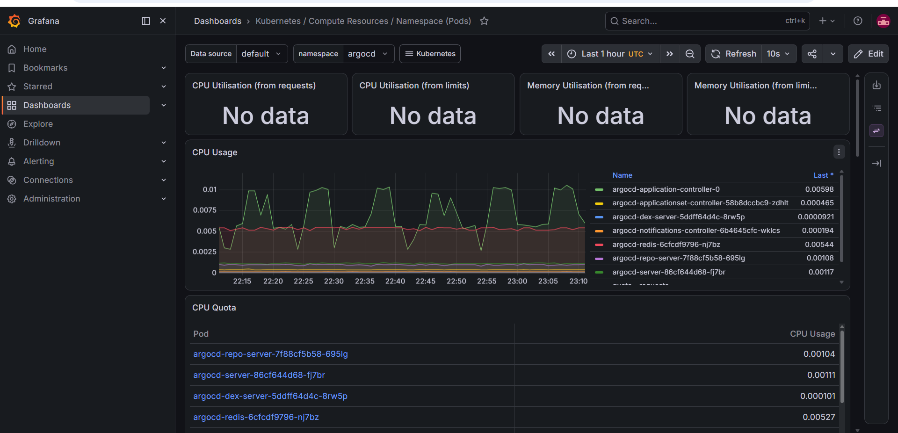

### Kubernetes Pod Dashboard

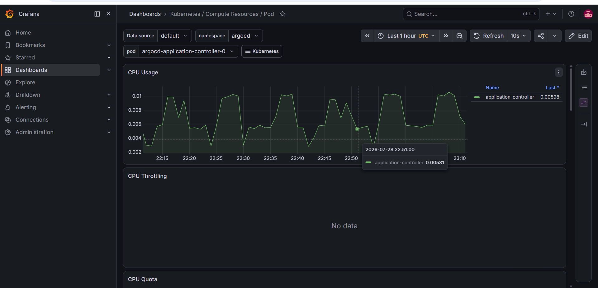

---

## Prometheus

Prometheus collects and exposes Kubernetes and platform metrics.

### Target Health

Configured scrape targets can be inspected through the Prometheus target health page.

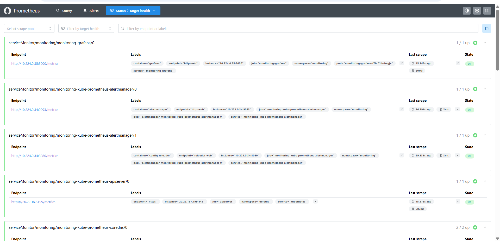

### Query Validation

The `up` query confirms whether monitored targets are reachable and being scraped successfully.

```promql
up
```

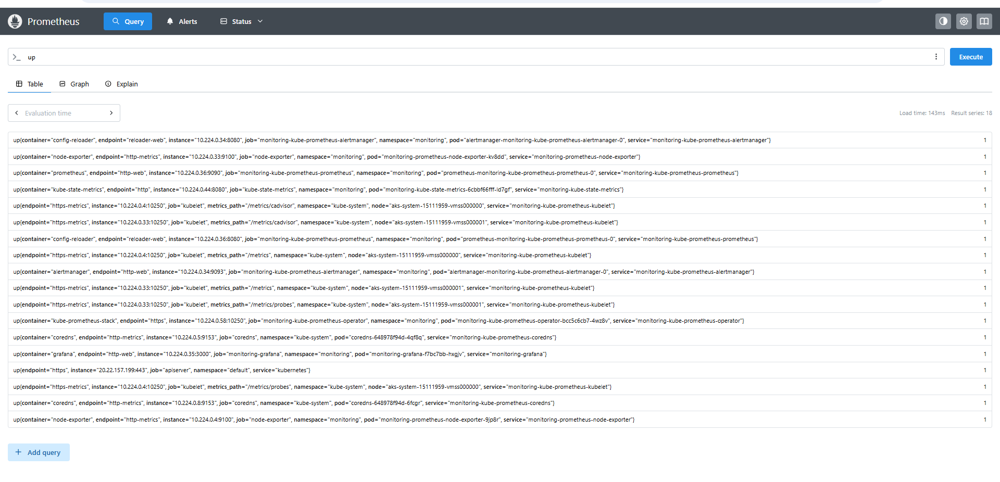

---

## Azure Application Insights

Application Insights captures application-level performance and telemetry.

It provides visibility into:

- Request volumes
- Request duration
- Operation performance
- Application failures
- Dependency behaviour
- End-to-end transaction telemetry

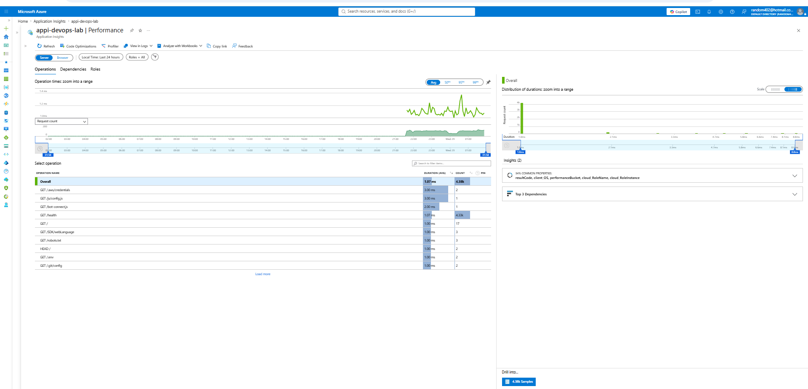

---

## Repository Structure

```text
.
├── .github/
│   └── workflows/
│
├── docs/
│   ├── architecture.md
│   └── images/
│
├── flask-app/
│   ├── templates/
│   ├── values.yaml
│   └── values-production.yaml
│
├── kubernetes/
│   ├── argocd/
│   ├── ingress/
│   ├── keyvault/
│   └── monitoring/
│
├── terraform/
│
└── README.md
```

---

## Deployment Workflow

```text
1. Developer commits application or configuration changes
2. GitHub Actions validates and builds the application
3. Trivy scans the container image
4. The image is pushed to Azure Container Registry
5. Git contains the desired deployment state
6. Argo CD detects the change
7. Argo CD synchronises the Helm release
8. AKS reconciles the workload
9. Prometheus, Grafana and Application Insights expose platform health
```

---

## Platform Validation

### Check Argo CD applications

```bash
kubectl get applications -n argocd
```

### Check application health

```bash
kubectl get pods -n production
```

### Check service and ingress

```bash
kubectl get svc,ingress -n production
```

### Check autoscaling

```bash
kubectl get hpa -n production
```

### Review application logs

```bash
kubectl logs -n production deployment/flask-web
```

### Review recent events

```bash
kubectl get events -n production \
  --sort-by=.metadata.creationTimestamp
```

---

## Engineering Decisions

### Git as the source of truth

Kubernetes deployments are managed declaratively through Git rather than by manually changing live cluster resources.

### Separation of CI and CD

GitHub Actions handles image build, security scanning and publication. Argo CD handles deployment and reconciliation.

### Managed secret delivery

Secrets are retrieved from Azure Key Vault rather than embedded in source code, container images or static Kubernetes manifests.

### Production-focused Kubernetes configuration

Health probes, resource requests, resource limits and autoscaling are included to improve resilience and runtime behaviour.

### Layered observability

Prometheus and Grafana provide Kubernetes visibility, while Application Insights provides application-level telemetry.

### Reproducible infrastructure

Terraform allows Azure resources to be reviewed, versioned and recreated consistently.

---

## Skills Demonstrated

- Azure Platform Engineering
- Azure Kubernetes Service
- Infrastructure as Code
- Terraform
- Kubernetes administration
- Docker
- Helm
- GitHub Actions
- CI/CD pipeline engineering
- GitOps
- Argo CD
- Azure Container Registry
- Azure Key Vault
- Managed Identity
- Kubernetes secret integration
- NGINX ingress
- TLS certificate automation
- Horizontal Pod Autoscaling
- Prometheus
- Grafana
- Azure Application Insights
- Linux
- Cloud troubleshooting
- Deployment validation
- Production monitoring

---

## Lessons Learned

This project reinforced several important platform engineering principles:

- Infrastructure should be reproducible and version controlled
- Git should remain the source of truth for declarative deployments
- Continuous integration and continuous delivery should have clearly separated responsibilities
- Secrets should be delivered through managed identity and dedicated secret-management platforms
- Observability should be designed into a platform rather than added after deployment
- Kubernetes workloads require health probes, resource controls and autoscaling
- Platform documentation should include evidence that the deployed system is healthy and operational

---

## Future Improvements

Potential production extensions include:

- Private AKS networking
- Azure Private Endpoints
- Azure Front Door
- Azure Application Gateway
- Workload Identity
- Azure Policy for Kubernetes
- Open Policy Agent or Gatekeeper
- OpenTelemetry Collector
- Loki log aggregation
- Tempo distributed tracing
- Alertmanager
- Disaster recovery automation
- Multi-environment promotion
- Cost monitoring and optimisation
- Automated Terraform policy checks
- End-to-end application tests

---

## Project Outcome

This project demonstrates an end-to-end Azure platform built with modern cloud-native engineering practices.

It combines:

- Infrastructure provisioning
- Secure application delivery
- Kubernetes operations
- GitOps reconciliation
- CI/CD automation
- Secret management
- HTTPS ingress
- Autoscaling
- Metrics and dashboards
- Application telemetry

The result is a reproducible, observable and production-inspired Azure application platform that demonstrates practical Platform Engineering and DevOps capability.
---

## Platform Documentation

Detailed design and operational documentation:

- [Platform Architecture](docs/architecture.md)
- [Engineering Decisions](docs/engineering-decisions.md)
- [Operational Runbook](docs/runbook.md)
- [Limitations and Future Improvements](docs/limitations.md)
