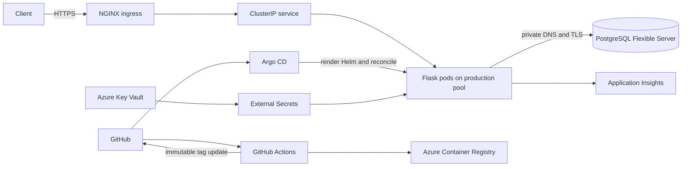

# Traditional Strength Production Platform

> A production Azure platform for delivering the Traditional Strength coaching application with Terraform, AKS, PostgreSQL, Helm, Argo CD, and GitHub Actions.


## Project overview

Traditional Strength is both a working coaching product and a platform-engineering portfolio project. The repository brings the Flask application, Azure infrastructure, Kubernetes packaging, deployment automation, security controls, operational tooling, and evidence into one reviewable system.

Its business purpose is to provide a dependable online home for strength-coaching workflows while creating a platform that can evolve without manual server configuration. Version 1 establishes the production foundation: repeatable infrastructure, private database connectivity, controlled secret delivery, immutable releases, and an auditable GitOps path.

## Version 1 repository status

The repository declares the Version 1 production foundation: two Terraform
roots, separate AKS System and User pools, private PostgreSQL networking, Key
Vault/External Secrets delivery, Helm and raw-manifest workloads, Argo CD
reconciliation, and path-scoped CI/CD gates. Historical screenshots and
committed resilience output record point-in-time deployments, but are not proof
of current live status. No live system was inspected for this documentation.

Production User-pool host encryption remains explicitly absent from Terraform;
the recorded quota blocker and exit criteria are in the
[production backlog](docs/production-backlog.md).

## Architecture



Use the [documentation index](docs/README.md) as the review entry point. The
[architecture](docs/architecture.md), [security architecture](docs/security.md)
and [operations and recovery](docs/operations.md) documents form the concise
evidence-scoped core. Network details are in [networking.md](docs/networking.md).

## Azure infrastructure

Terraform manages the resource group, virtual network and delegated database subnet, monitoring resources, ACR configuration, PostgreSQL Flexible Server, private DNS, VNet links and peering, AKS, identities, RBAC, and node pools. Remote Azure Storage backends provide locking and separate the root infrastructure state from the AKS state.

The split is deliberate: `infra/` owns shared application infrastructure and the database; `infra/aks/` owns the cluster and its pools. Imported production resources remain under Terraform control without destructive recreation. PostgreSQL carries `prevent_destroy`, and Azure-assigned zone changes are ignored to avoid false replacement plans after import.

### AKS node-pool design

| Pool | Mode | Purpose | Key controls |
| --- | --- | --- | --- |
| `system` | System | Kubernetes and cluster-critical add-ons | Critical-addons-only, host encryption, Azure Linux, ephemeral OS disk |
| `production` | User | Traditional Strength application and migration Job | `workload=production` label, cluster autoscaler, Azure Linux, ephemeral OS disk |

The Helm chart's default `nodeSelector` sends both the Deployment and migration hook to the production pool. This separates application capacity from system services. Production-pool host encryption remains deferred only because the required rotation node exceeded regional quota.

## Application architecture

The production container runs the Flask portal behind Gunicorn. The Helm release provides a rolling Deployment, `ClusterIP` Service, TLS ingress, startup/readiness/liveness probes, a Pod Disruption Budget, resource requests and limits, topology preferences, restrictive security contexts, and ingress/egress NetworkPolicies.

Tracked production values declare database-cutover mode: one replica and HPA
disabled. A `values-scale-out.yaml` overlay exists but is not selected by the
Argo CD Application. Every install or upgrade first runs `flask db upgrade` as
a no-retry Helm hook using the same immutable image as the Deployment.

## PostgreSQL and private networking

Azure Database for PostgreSQL Flexible Server runs in a delegated subnet with public network access disabled, TLS required, and TLS 1.2 as the minimum. Terraform manages the database, private DNS zone and VNet links. Bidirectional peering connects the AKS VNet to the application VNet; the PostgreSQL private zone is linked so cluster DNS resolves the server's private address.

The application receives `DATABASE_URL` from a Kubernetes Secret and never from Helm values. See [Azure PostgreSQL operations](docs/azure-postgresql.md) for migration, backup, restore, and scale-out guidance.

## Secrets management

Secret values live in Azure Key Vault. External Secrets Operator authenticates with Microsoft Entra Workload Identity through the `external-secrets-kv` ServiceAccount, reads approved Key Vault entries, and owns the `flask-runtime-secrets` Kubernetes Secret. The application consumes `SECRET_KEY`, `DATABASE_URL`, and `APPLICATIONINSIGHTS_CONNECTION_STRING` with `secretKeyRef`; values are not committed or printed during validation.

## CI/CD and GitOps

GitHub Actions and Argo CD have separate responsibilities:

1. Pull requests run relevant tests, Helm rendering, Terraform validation, Checkov, Trivy, CodeQL, and browser/release checks according to path filters.
2. On `main`, the application workflow builds and scans the image, authenticates to Azure with GitHub OIDC, and publishes immutable Git-SHA tags to ACR.
3. The workflow updates `flask-app/values-production.yaml` in Git.
4. Argo CD observes `main`, renders the Helm chart, and reconciles the `production` namespace with pruning and self-healing.
5. The workflow verifies the migration-gated rollout and public health endpoint.

Git is the desired-state source of truth; ACR stores deployable images; Argo CD, rather than CI, performs the Kubernetes deployment.

## Terraform structure

```text
infra/
├── environments/dev/       # backend and reviewed environment inputs
├── modules/
│   ├── monitoring/          # Log Analytics and Application Insights
│   ├── network/             # VNet and delegated database subnet
│   ├── postgresql/          # Flexible Server, DNS, database, KV metadata
│   └── resource-group/
├── aks/                     # independent AKS state and node pools
└── *.tf                     # root composition, ACR, peering, outputs
```

## Helm deployment

`flask-app/` is the production chart. `values-production.yaml` contains environment-specific routing, resources, database mode, and immutable image selection. The Argo CD Application uses release name `flask-web-prod`; operators should change desired state in Git rather than running an untracked `helm upgrade` or `kubectl scale`.

```bash
helm lint flask-app -f flask-app/values-production.yaml
helm template flask-web-prod flask-app \
  --namespace production \
  -f flask-app/values-production.yaml
```

## Observability and security

The production portal includes `/health`, probes and Gunicorn stdout/stderr.
Terraform declares Application Insights and Log Analytics resources and AKS
Container Insights wiring. The production portal does not expose `/metrics` or
initialize OpenTelemetry/Azure Monitor instrumentation. Repository screenshots
record historical Prometheus/Grafana evidence; ServiceMonitor, PrometheusRule
and Grafana dashboard resources are disabled in production.

Security controls include OIDC-based CI authentication, Workload Identity, Key Vault, External Secrets, Pod Security `restricted`, non-root containers, dropped Linux capabilities, no privilege escalation, RuntimeDefault seccomp, a read-only root filesystem, NetworkPolicies, immutable image tags, Trivy, Checkov, CodeQL, Dependabot, and SBOM generation. Current gaps are listed under [known limitations](docs/limitations.md).

## Repository layout

| Path | Purpose |
| --- | --- |
| `platform-portal/` | Production Flask coaching portal and migrations |
| `app/` | Supporting Flask service and tests |
| `flask-app/` | Production Helm chart and values |
| `kubernetes/` | Argo CD, External Secrets, ingress, and monitoring manifests |
| `infra/` | Shared Azure Terraform root and modules |
| `infra/aks/` | AKS Terraform root |
| `.github/workflows/` | Application, infrastructure, security, browser, and tooling automation |
| `e2e/` | Playwright release tests |
| `scripts/` | Developer, release, inventory, and operational helpers |
| `docs/` | Architecture, decisions, runbooks, evidence, backlog, and roadmap |

## Local development

Prerequisites are Python 3.12+, Node.js 20+, npm, GNU Make, Helm 3, Terraform, Git, and optionally loopback PostgreSQL. Follow the [local development guide](docs/local-development.md) for environment setup and safety boundaries.

```bash
make help
make setup-check
make lint
make test
make playwright
make helm-validate
```

`make release-gate` requires a clean worktree and produces sanitised evidence. Local PostgreSQL tests are opt-in through a loopback-only `traditional_strength_test` database.

## Deployment and validation commands

These commands validate declared state; Terraform apply and production mutation remain protected operations.

```bash
terraform -chdir=infra fmt -check -recursive
terraform -chdir=infra init -backend=false
terraform -chdir=infra validate
terraform -chdir=infra/aks init -backend=false
terraform -chdir=infra/aks validate
checkov --directory infra --framework terraform --compact --quiet
helm lint flask-app -f flask-app/values-production.yaml
helm template flask-web-prod flask-app -n production \
  -f flask-app/values-production.yaml > /tmp/flask-production.yaml
```

For an authenticated, reviewed infrastructure plan:

```bash
terraform -chdir=infra init -backend-config=environments/dev/backend.hcl
terraform -chdir=infra plan \
  -var-file=environments/dev/terraform.tfvars \
  -var=postgresql_enabled=true
terraform -chdir=infra/aks init -backend-config=environments/dev/backend.hcl
terraform -chdir=infra/aks plan \
  -var-file=environments/dev/terraform.tfvars
```

## Production verification

```bash
curl --fail --silent --show-error https://traditionalstrength.co.uk/health
kubectl get application flask-web-production -n argocd
argocd app get flask-web-production
kubectl get deployment,pods,service,ingress -n production
kubectl get pods -n production -o wide
kubectl get externalsecret,secretstore -n production
kubectl get nodes -L agentpool,workload
```

Expected: HTTP health succeeds; Argo CD is `Synced` and `Healthy`; the Deployment is available; application and migration pods use the production pool; and the ExternalSecret is Ready. Do not decode Kubernetes Secrets during verification.

## Known limitations

- Single Azure region and single production application replica during database cutover.
- Public AKS API restricted by authorized IP ranges, rather than a private control plane.
- Public NGINX ingress without Azure Front Door/WAF or a private origin.
- Production-pool host encryption blocked by East US 2 vCPU quota; see [production-backlog.md](docs/production-backlog.md).
- PostgreSQL geo-redundant backup and high availability are disabled as explicit cost/RPO trade-offs.
- Proposed Prometheus alerts and dashboard resources are not enabled in production; no formal SLO/error budget exists.
- No complete dev-to-staging-to-production promotion path, multi-region recovery, or enforced image signatures.

## Roadmap

- **Version 1 — complete:** production foundation, AKS pool separation, private PostgreSQL, secret delivery, Helm/Argo CD GitOps, CI/CD quality gates, and validated public health.
- **Version 2 — reliability and delivery:** safe scale-out, active monitoring and alert routing, SLOs, restore exercises, staging and promotion, WAF/private-origin design, image signing, and completion of the quota-blocked host-encryption change.
- **Version 3 — product and platform evolution:** multi-region recovery, stronger identity and tenant boundaries, event-driven/background services, richer coaching analytics, and capacity/cost automation driven by measured demand.

See the [versioned roadmap](docs/roadmap.md) for boundaries and exit criteria.

## Screenshots

| Evidence | Screenshot |
| --- | --- |
| Application over HTTPS |  |
| Argo CD Synced and Healthy |  |
| Production Kubernetes resources |  |
| GitHub Actions pipeline |  |
| Azure resource group |  |

Additional placeholders for a future evidence refresh: AKS node pools and labels, PostgreSQL private networking/DNS, ExternalSecret Ready status, and Terraform plan/apply summaries with sensitive data removed.

## Further documentation

- [Documentation map](docs/README.md)
- [Architecture](docs/architecture.md)
- [Security architecture](docs/security.md)
- [Operations and recovery](docs/operations.md)
- [Engineering decisions](docs/engineering-decisions.md)
- [Limitations and roadmap](docs/limitations.md)
