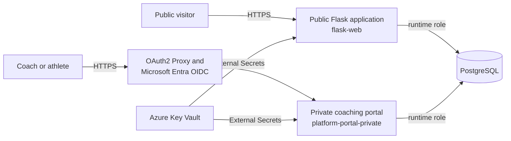
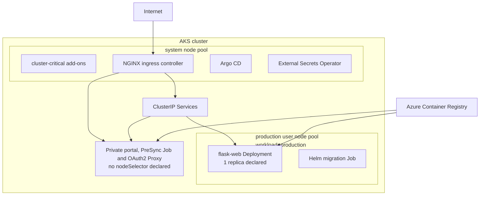
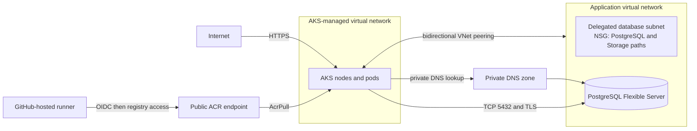
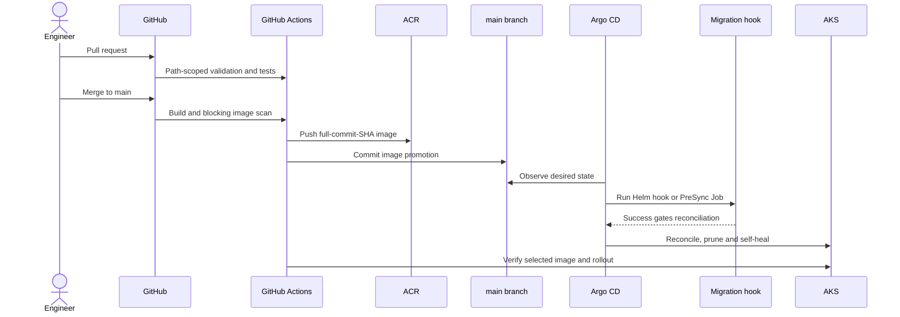
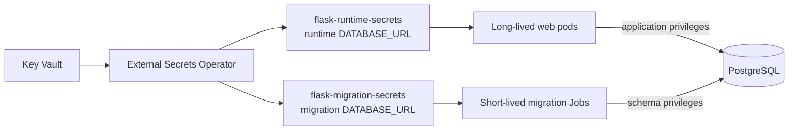
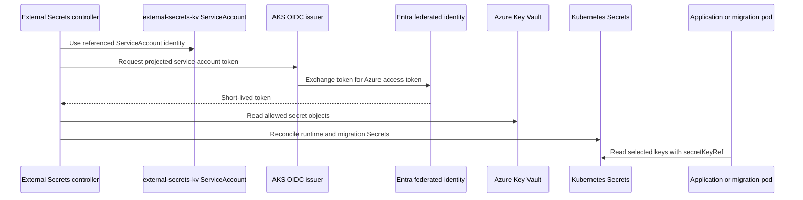

# Traditional Strength architecture

## Evidence and scope

This document describes the architecture declared by the current repository. It
does not assert that Azure or Kubernetes resources are currently running. The
evidence hierarchy used here is:

1. executable Terraform, Helm, Kubernetes manifests, application code and
   GitHub Actions workflows;
2. local tests and validation scripts;
3. operational evidence committed under `evidence/` and screenshots, which are
   historical point-in-time records rather than proof of current state; and
4. roadmap documents, which are explicitly future work.

The repository contains two production application delivery paths that share
AKS, PostgreSQL and runtime secrets. It also contains a separately packaged
lead-magnet chart. No live-system inspection was performed for this document.

## System context and application boundaries



| Boundary | Repository implementation | Exposure and data boundary |
| --- | --- | --- |
| Public application | `platform-portal` image deployed by the `flask-app` Helm chart | NGINX Ingress for the public site; a `ClusterIP` Service; Flask health and portal routes; PostgreSQL through the runtime database secret |
| Private coaching platform | Same source tree, a distinct private image and raw manifests in `private-platform-manifests/` | Separate hostname; NGINX external-auth annotations delegate authentication to OAuth2 Proxy using Entra OIDC; its Service remains `ClusterIP` |
| Database migration | Helm pre-install/pre-upgrade Job for `flask-web`; Argo CD `PreSync` Job for the private portal | Short-lived pod uses `flask-migration-secrets`; a failed hook blocks the corresponding application reconciliation |
| Lead magnets | Independent Helm chart and Argo CD Application | Separate image, ingress and persistent volume; it is not part of the coaching portal release |

The public and private images are promoted independently. They are not separate
microservices with independent domain data: both are built from
`platform-portal/` and the declared production manifests connect both to the
same PostgreSQL service. The private path adds edge authentication; application
authorization remains implemented inside Flask.

## AKS and application topology



Terraform declares a System pool and an autoscaling `production` User pool. The
Helm web Deployment and its migration Job select `workload=production`. The raw
private-platform manifests do not declare that node selector, so Kubernetes may
schedule them on any eligible node; System-pool critical-addons tainting is the
only repository-declared scheduling constraint affecting them.

The System pool uses Azure Linux, ephemeral OS disks, host encryption and
`only_critical_addons_enabled`. The User pool uses Azure Linux, ephemeral OS
disks and autoscaling, but does not enable host encryption. The cluster has a
public API with authorized IP ranges, Azure network policy, Azure Policy,
Workload Identity, the OIDC issuer, image cleaner, Container Insights and
`AcrPull` assigned to the kubelet identity. It is not a private AKS cluster.

## Azure resource and network topology



The root Terraform stack declares bidirectional peering between the
application VNet and an existing AKS VNet. PostgreSQL uses delegated-subnet
private access, not a Private Endpoint, and public database access is disabled.
The private DNS zone is linked to the application VNet and to additional VNet
IDs supplied as environment inputs; AKS resolution therefore depends on the AKS
VNet being present in that input map. The Helm NetworkPolicy permits PostgreSQL
only to the declared private database CIDR on TCP 5432.

Public paths remain: the NGINX load balancer/ingress, the authorized AKS API,
and the Basic-tier ACR used by hosted CI. The repository does not declare Azure
Front Door, WAF, NAT Gateway, a private ACR endpoint or a private AKS control
plane.

See [Networking](networking.md) for the control matrix and failure checks.

## Terraform and ownership boundaries

```text
infra/
├── backend.tf                 # Azure Storage backend declaration
├── main.tf                    # root module composition, KV lookup, peering
├── acr.tf                     # Basic ACR
├── modules/
│   ├── resource-group/
│   ├── network/               # application VNet, DB subnet and NSG
│   ├── monitoring/            # Log Analytics, App Insights and a DCR
│   └── postgresql/            # Flexible Server, DB, DNS and KV metadata
├── environments/dev/          # tracked backend and environment inputs
└── aks/                       # separate backend/state, cluster and node pools
```

The split creates two Terraform states. `infra/` owns shared Azure resources,
PostgreSQL and VNet peering; `infra/aks/` owns AKS, node pools and the ACR pull
role assignment. Both use Azure Storage backends configured by environment
files. PostgreSQL is protected with `prevent_destroy`; its generated
administrator password is necessarily sensitive state. The Key Vault itself,
External Secrets identity/federated credential, ingress controller, Argo CD and
External Secrets Operator installation are not provisioned by these Terraform
roots.

The general Terraform workflow validates both roots on pull requests. A push to
`main` plans both roots, stores each binary plan for one day, and applies the
reviewed artifacts through the `production` GitHub environment. Repository code
cannot prove which environment protection rules are configured in GitHub.

## CI/CD, GitOps and ownership



Ownership is deliberately divided:

- GitHub Actions owns source tests, manifest validation, image build/scan,
  registry publication, the desired-image commit and post-promotion checks.
- ACR owns image storage; the promoted tag is the full source commit SHA.
- Git `main` owns desired deployment state.
- `flask-web-production`, `platform-portal-private` and
  `external-secrets-production` Argo CD Applications own their respective
  rendered resources. Automated pruning and self-healing are enabled.
- Argo CD, not CI, performs steady-state Kubernetes reconciliation.

Pull requests and feature branches do not publish or promote. The workflows use
concurrency groups per ref; the promotion helper rebases/retries if `main`
advances, reducing collisions between the public and private release workflows.
There is no staging Application or environment-to-environment promotion chain:
current promotion is a `main` build directly updating production desired state.

## PostgreSQL and credential separation

Terraform declares PostgreSQL Flexible Server 16 with private access, TLS 1.2
minimum, secure transport, auto-grow, a configurable 7–35 day backup retention,
optional HA and optional geo-redundant backup. Tracked environment values select
seven days, no HA and no geo-redundant backup.



The separation is implemented at delivery time: long-lived pods reference only
`flask-runtime-secrets`, while schema Jobs reference
`flask-migration-secrets`. The repository maps these from different Key Vault
secret names. It does not provision the PostgreSQL runtime role, migration role
or grants, so least-privilege enforcement inside PostgreSQL is an external
prerequisite and must not be inferred from the two connection strings.

## Identity and secret delivery



AKS enables its OIDC issuer and Workload Identity. The ServiceAccount annotation
selects an Entra application identity, and `SecretStore` uses
`authType: WorkloadIdentity`. The required Entra federated credential and Key
Vault data-plane role assignment are not declared in Terraform here; their
existence is an installation prerequisite. Secret values are not in Helm
values. They do exist in namespace-scoped Kubernetes Secrets after sync.

## Observability

Implemented repository paths are shallow HTTP health, container/Helm probes,
Gunicorn stdout/stderr, a Log Analytics workspace, AKS `oms_agent` wiring and a
workspace-based Application Insights resource. The application receives an
Application Insights connection string, but the production application has no
Azure Monitor/OpenTelemetry initialization; that injection alone is not trace
or metric instrumentation.

Prometheus `ServiceMonitor`, `PrometheusRule` and Grafana dashboard templates
are disabled in production. The production application has no `/metrics`
endpoint, monitoring ingress is disabled, Alertmanager routing is absent, and
Loki/Tempo are plans only. See [Observability current state](observability-current-state.md).

## Recovery, release and rollback

The implemented database protection is Azure-managed point-in-time backup
retention configured in Terraform. The repository provides a documented
restore command and validation checklist, but no automated restore workflow and
no recorded PostgreSQL restore exercise. HA, geo-redundant backup and
multi-region recovery are disabled or absent.

Application rollback is GitOps-oriented: revert the image promotion commit so
Argo CD reconciles the previous immutable image. A Kubernetes rollout undo is
temporary containment because self-healing will restore Git state. Database
schema downgrade is not automated and must be evaluated separately for data
compatibility. See [Operations and recovery](operations.md).

## Implemented versus planned

| Implemented in repository | Planned, disabled or external prerequisite |
| --- | --- |
| Two Terraform roots; AKS and User/System pools; ACR; private PostgreSQL; peering and private DNS declarations | Private AKS/API, private ACR, Front Door/WAF and multi-region network |
| Public and authenticated-private application paths with independent immutable-image promotion | Complete dev/staging/production promotion |
| Argo CD Applications with automated prune/self-heal and migration hooks | Argo CD installation/bootstrap and a formal app-of-apps hierarchy |
| Key Vault references, External Secrets mappings and Workload Identity ServiceAccount | Federated credential and Key Vault role assignment as IaC; automated DB credential rotation |
| Runtime/migration Kubernetes Secret separation | Repository-provisioned PostgreSQL roles/grants proving least privilege |
| Pod security contexts, restricted namespace labels and selected NetworkPolicies | Admission-time signature/provenance verification; full egress restriction for every private-platform pod |
| Managed PostgreSQL backup retention and documented PITR procedure | Tested restore evidence, formal RPO/RTO, HA and geo-redundant backup |
| Health probes, stdout/stderr and Azure monitoring resource foundations | Production app telemetry instrumentation, active Prometheus/Grafana alerts, SLOs, Loki and Tempo |
| Pytest, Playwright, Helm, Terraform, Checkov, Trivy, CodeQL and SBOM workflow gates | Repository evidence that GitHub branch/environment approval rules are enabled |

The [limitations](limitations.md) and [roadmap](roadmap.md) define the future V6
and SaaS boundary. In particular, tenant isolation, tenant-aware data access,
billing, self-service provisioning, data residency, per-tenant auditability and
service-level objectives are not implemented SaaS capabilities.
