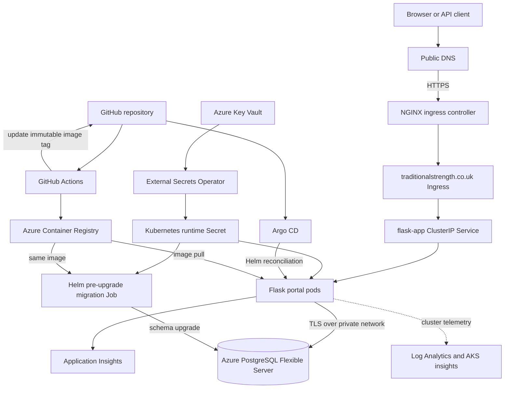
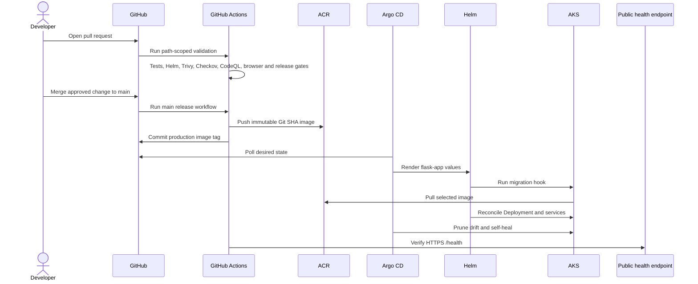
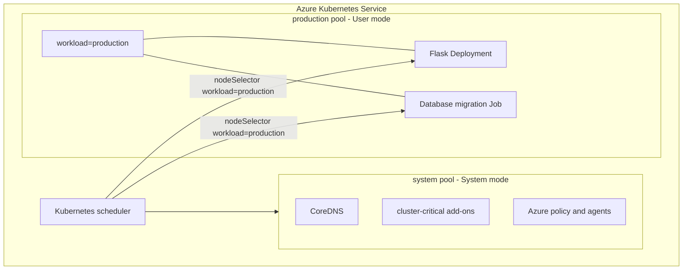
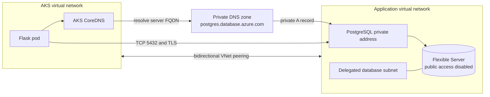
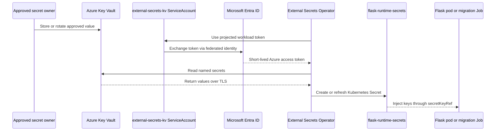

# Version 1 architecture

## Scope and validated state

This document describes the implemented Traditional Strength Version 1 platform. The production Argo CD Application `flask-web-production` is Synced and Healthy, and the public `/health` endpoint is healthy. Disabled chart features and roadmap items are identified explicitly.

## End-to-end platform architecture

The application is exposed only through an ingress-backed `ClusterIP` Service. Production uses one application replica during PostgreSQL cutover; the scale-out overlay is not active.

## CI/CD and GitOps deployment flow

Feature branches validate but do not publish or promote. GitHub OIDC supplies short-lived Azure authentication. Git contains desired state, ACR contains images, and Argo CD owns delivery to AKS.

## AKS system pool and production workload pool

The system pool uses `only_critical_addons_enabled`, host encryption, an ephemeral OS disk, and Azure Linux. The autoscaling production User pool carries the workload label and also uses Azure Linux and an ephemeral OS disk. Host encryption on that pool is the sole quota-blocked hardening item documented in [production-backlog.md](production-backlog.md).

## AKS-to-PostgreSQL private networking and DNS

Terraform manages both peering directions and links the private DNS zone to the application VNet and AKS VNet. The application connects by FQDN with TLS rather than by a fixed address. The server has public network access disabled and is protected from accidental Terraform destruction.

## Secret flow from Key Vault to Kubernetes

The `ExternalSecret` refreshes `SECRET_KEY`, `DATABASE_URL`, and `APPLICATIONINSIGHTS_CONNECTION_STRING`. Terraform state contains the generated PostgreSQL administrator password because Azure requires it for resource creation, so state access is a sensitive security boundary. Neither Helm nor Git stores the runtime values.

## Infrastructure ownership

| Concern | Source of truth |
| --- | --- |
| Shared Azure resources, network, PostgreSQL | `infra/` Terraform state and configuration |
| AKS and node pools | `infra/aks/` Terraform state and configuration |
| Application package | `flask-app/` Helm chart |
| Production image selection | `flask-app/values-production.yaml` |
| Kubernetes reconciliation | `kubernetes/argocd/flask-web-production.yaml` and Argo CD |
| Runtime secret values | Azure Key Vault |
| Secret synchronisation | `kubernetes/external-secrets/azure-key-vault.yaml` |
| Images | Azure Container Registry |

## Runtime controls

The chart implements rolling updates, a pre-deployment migration hook, startup/readiness/liveness probes, a Pod Disruption Budget, CPU and memory controls, topology preferences, non-root execution, dropped capabilities, RuntimeDefault seccomp, a read-only root filesystem, Pod Security `restricted`, and default-deny ingress/egress with explicit required paths.

Observability includes application health and metrics endpoints, Application Insights/Log Analytics infrastructure, Azure Monitor instrumentation, and runbooks. Prometheus Operator objects exist in the chart but are disabled in production pending live label and routing validation; screenshots are evidence of prior monitoring use, not proof that every proposed resource is currently active.

## Related documents

- [Azure networking architecture](networking.md)
- [Version 1 summary](version-1-summary.md)
- [Engineering decisions](engineering-decisions.md)
- [Azure PostgreSQL](azure-postgresql.md)
- [Operational runbook](runbook.md)
- [Roadmap](roadmap.md)
