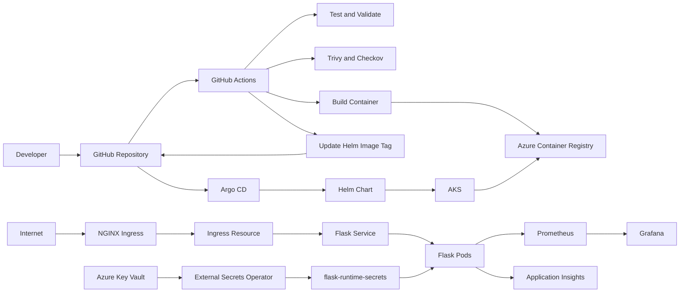
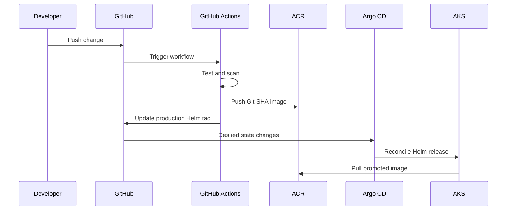
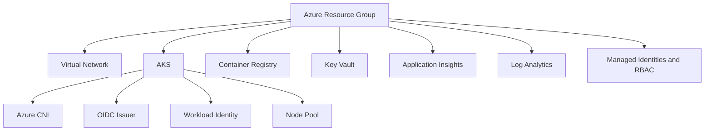

# Platform Architecture

## Overview

This repository implements an Azure platform for building, securing, deploying and observing a containerised Flask application on Azure Kubernetes Service.

Core components:

- Terraform for Azure infrastructure
- Azure Kubernetes Service for orchestration
- Azure Container Registry for images
- GitHub Actions for CI and promotion
- GitHub OIDC for secretless Azure authentication
- Argo CD for GitOps delivery
- Helm for Kubernetes packaging
- NGINX Ingress and cert-manager for HTTPS
- External Secrets Operator and Azure Key Vault for runtime secrets
- Microsoft Entra Workload Identity for Kubernetes-to-Azure authentication
- Prometheus and Grafana for metrics
- OpenTelemetry and Application Insights for application telemetry

## End-to-End Architecture



## Delivery Model

The platform separates image delivery from desired-state delivery.

### Image path

```text
GitHub Actions -> build and scan -> ACR -> AKS pulls immutable Git SHA image
```

### Desired-state path

```text
GitHub Actions -> update Helm image tag in Git -> Argo CD -> Helm -> AKS
```

Argo CD does not deploy from ACR. Git is the source of truth for desired state; ACR stores deployable images.

## CI/CD and GitOps Flow



## Azure Infrastructure



Terraform is split between root Azure infrastructure and AKS configuration. Local state, plans and provider caches are excluded from Git.

## Identity Flows

### GitHub Actions to Azure

GitHub Actions requests a signed OIDC token. Microsoft Entra ID validates the configured issuer, subject and audience and returns a short-lived Azure access token. No long-lived Azure client secret is stored in GitHub.

### AKS to Key Vault

External Secrets Operator uses the `external-secrets-kv` ServiceAccount. Microsoft Entra Workload Identity exchanges its projected token for Azure access, then External Secrets retrieves the Key Vault value and creates or refreshes `flask-runtime-secrets`.

The Flask Deployment consumes the generated Kubernetes Secret through `secretKeyRef`.

## Kubernetes Runtime

Implemented controls include:

- Rolling Deployment
- readiness and liveness probes
- CPU and memory requests and limits
- Horizontal Pod Autoscaler
- Pod Disruption Budget
- default-deny ingress NetworkPolicy
- explicit NGINX ingress allowance
- explicit Prometheus allowance
- ServiceMonitor
- Argo CD automated sync, pruning and self-healing

## Traffic Path

Current production exposure:

```text
Internet -> NGINX Ingress -> Flask Service -> Pods
Internet -> Flask LoadBalancer Service -> Pods
```

Target exposure:

```text
Internet -> NGINX LoadBalancer -> Ingress -> ClusterIP Flask Service -> Ready Pods
```

The Flask Service should be changed from `LoadBalancer` to `ClusterIP` so NGINX remains the single public entry point.

## Observability

### Prometheus path

```text
Flask /metrics -> ServiceMonitor -> Prometheus -> Grafana
```

### Azure telemetry path

```text
Flask OpenTelemetry -> Azure Monitor exporter -> Application Insights -> Log Analytics
```

Prometheus supports platform and application metrics. Application Insights supports requests, traces, dependencies, exceptions and Azure-native diagnostics.

## Availability and Scaling

Production requests two replicas. The PDB keeps at least one available during voluntary disruptions. HPA includes CPU-based scaling and explicit scale-up and scale-down behaviour.

Topology spreading and pod anti-affinity are not yet enforced, so replicas may share the same node.

## Security Controls

Implemented:

- GitHub OIDC
- Microsoft Entra Workload Identity
- Azure Key Vault
- External Secrets Operator
- immutable Git SHA image tags
- Trivy and Checkov
- TLS ingress
- ingress NetworkPolicies
- GitOps reconciliation
- resource requests and limits

Planned:

- non-root execution
- privilege escalation disabled
- all capabilities dropped
- RuntimeDefault seccomp
- read-only root filesystem where compatible
- startup probe
- topology spread
- default-deny egress
- image signing and provenance

## Source of Truth

| Concern | Source of truth |
|---|---|
| Azure infrastructure | Terraform |
| Kubernetes package | Helm |
| Production image | `flask-app/values-production.yaml` |
| Kubernetes desired state | Git |
| Container image | ACR |
| Runtime secret value | Azure Key Vault |
| Secret synchronisation | ExternalSecret |
| Deployment reconciliation | Argo CD |
| CI and promotion | GitHub Actions |

## Related Documentation

- [Engineering Decisions](engineering-decisions.md)
- [Operational Runbook](runbook.md)
- [Limitations and Future Improvements](limitations.md)
