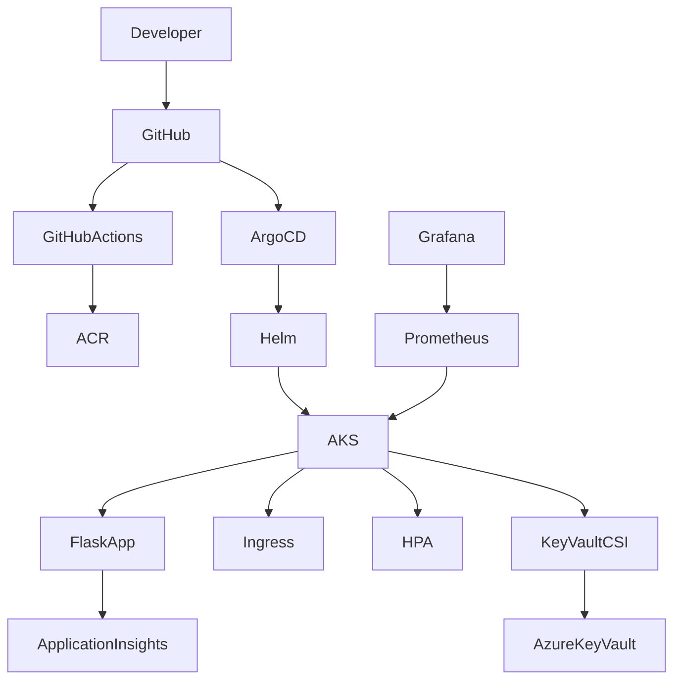

# Azure Platform Architecture

## Overview

This project demonstrates a production-style Azure Platform deployment using Terraform, AKS, GitHub Actions, Helm and Argo CD.

## Architecture Diagram

## Deployment Flow

1. A developer pushes code to GitHub.
2. GitHub Actions builds the Docker image.
3. The image is pushed to Azure Container Registry.
4. Argo CD detects the Git change.
5. Helm renders the Kubernetes manifests.
6. AKS reconciles to the desired state.
7. The application retrieves secrets from Azure Key Vault via the CSI Driver.
8. Metrics are collected by Prometheus and visualised in Grafana.

## Components

| Component | Purpose |
|----------|---------|
| Terraform | Provision Azure infrastructure |
| AKS | Run Kubernetes workloads |
| Helm | Package Kubernetes manifests |
| Argo CD | GitOps continuous delivery |
| Azure Container Registry | Store container images |
| Azure Key Vault | Secure secret storage |
| Managed Identity | Authenticate to Azure services |
| Prometheus | Metrics collection |
| Grafana | Dashboards |
| Application Insights | Application telemetry |

## Security

- HTTPS using cert-manager
- Managed Identity
- Azure Key Vault
- Secrets Store CSI Driver
- Kubernetes RBAC

## Monitoring

- Prometheus
- Grafana
- Application Insights

## GitOps

Git is the single source of truth.

Argo CD continuously monitors the repository and reconciles any drift between the cluster and the desired state.
