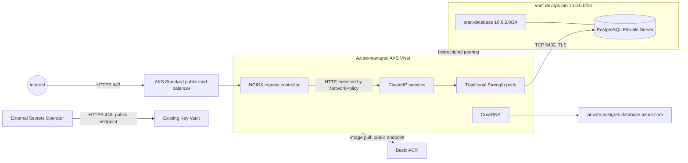

# Azure networking architecture

## Scope and audit basis

This document records the networking declared in this repository as of August
2026. It does not claim that undeclared Azure resources exist. The two Terraform
roots use separate Azure Storage state keys: `azure-observability-dev.tfstate`
for `infra/` and `azure-aks-dev.tfstate` for `infra/aks/`. Both use Azure AD and
Azure CLI authentication; state access is sensitive because the PostgreSQL
administrator password is generated by Terraform and stored in state.

## Current traffic flow

There is no Azure Front Door, Application Gateway, WAF, NAT Gateway, Azure
Firewall, private AKS API, Key Vault private endpoint, ACR private endpoint, or
Terraform-managed storage account endpoint in the repository.

## Network boundaries and ownership

| Boundary | Address/purpose | Ownership | Controls |
| --- | --- | --- | --- |
| Application VNet | `vnet-devops-lab`, `10.0.0.0/16` | `infra/modules/network` | Peered to the Azure-managed AKS VNet |
| Database subnet | `snet-database`, `10.0.2.0/24` | `infra/modules/network` | PostgreSQL delegation and `nsg-database` |
| AKS VNet and node subnet | Names supplied per environment; address space is not declared here | AKS/Azure-managed node resource group | Azure CNI, Azure NetworkPolicy, Standard load balancer |
| Ingress | Public NGINX controller endpoint | Cluster add-on outside these Terraform roots | TLS Ingress objects; application Services are `ClusterIP` |

No private-endpoint subnet is created because no private endpoint is currently
safe to enable. The existing single delegated database subnet has a clear
purpose. The AKS root lets Azure create and manage its VNet, so this repository
cannot honestly claim a dedicated ingress or node subnet boundary.

## PostgreSQL networking

PostgreSQL Flexible Server uses private-access delegated-subnet integration,
not a Private Endpoint. `public_network_access_enabled = false`, the database
subnet is delegated to `Microsoft.DBforPostgreSQL/flexibleServers`, and TLS 1.2
or later is required. Bidirectional VNet peering carries AKS-to-database traffic.
The Helm NetworkPolicy limits production database egress to `10.0.2.0/24` on
TCP 5432; the application still connects by FQDN so Azure can manage the server
address within that subnet.

## Private DNS dependencies

| Zone/name | Consumers | VNet links | Status |
| --- | --- | --- | --- |
| `private.postgres.database.azure.com` | Application and migration pods | Application VNet plus the AKS VNet | Terraform-managed and required |
| `privatelink.vaultcore.azure.net` | External Secrets and Terraform secret management | None | Not created; Key Vault remains public |
| `privatelink.azurecr.io` | AKS image pulls and CI image pushes | None | Not created; Basic ACR cannot use Private Link |

CoreDNS forwards external resolution through the AKS platform DNS path. No
custom DNS server or forwarding ruleset is declared. PostgreSQL DNS VNet links
have registration disabled, which is correct for an Azure-managed private zone.

## NSG review

`nsg-database` is the only Terraform-managed NSG. It permits inbound TCP 5432
from the `VirtualNetwork` service tag, which includes the peered AKS VNet, then
denies other inbound traffic. Outbound rules permit PostgreSQL traffic within
the virtual network and HTTPS to Azure Storage, then deny other outbound
traffic. Priorities are deterministic (`100`, `110`, then `200`). There is no
Internet inbound allow rule.

The source is not narrowed to a guessed AKS CIDR because the AKS VNet address
space is not declared in this repository. Changing the live delegated-subnet
NSG without confirming Flexible Server platform dependencies could cause an
outage. A future move to a customer-managed AKS VNet should pass its exact node
subnet prefix into the database NSG and validate PostgreSQL health before and
after rollout.

## AKS exposure and policies

The control plane is public but restricted to environment-supplied authorized
CIDRs. The data plane uses Azure CNI and Azure NetworkPolicy. Cluster egress uses
the Standard load balancer (`outbound_type = "loadBalancer"`). Public traffic
enters through NGINX; workload Services are `ClusterIP`.

The production Flask chart applies default-deny ingress and egress, then allows
CoreDNS, HTTPS dependencies, ingress-controller traffic, and private PostgreSQL
traffic. Monitoring ingress is opt-in. The lead-magnets chart now explicitly
selects `Egress`, making its existing DNS exception effective under its combined
default-deny policy. Broader raw manifests and private-portal policies are kept
unchanged because their full identity, OAuth, Redis, certificate, and telemetry
flows cannot be safely narrowed from repository evidence alone.

## Current state versus next target

| Area | Current state | Production target / prerequisite |
| --- | --- | --- |
| Internet edge | Public Standard LB to NGINX, no WAF | Front Door Premium/WAF or Application Gateway only after choosing an edge pattern, certificates, health probes, and origin restriction |
| PostgreSQL | Private delegated subnet and private DNS | Retain; validate DNS and TCP 5432 after every network change |
| Key Vault | Existing public endpoint used by ESO and Terraform | Private Endpoint only with `privatelink.vaultcore.azure.net`, AKS DNS/linking, and a tested private path for Terraform/secret operators; then restrict public access |
| ACR | Basic SKU, public endpoint; admin disabled | Premium plus Private Link, private DNS, and private CI runners before disabling public access |
| AKS API | Public, authorized CIDRs | Private cluster in a separate migration after private runner/operator access and DNS are proven |
| AKS VNet | Azure-managed | Consider customer-managed node and ingress subnets during a planned cluster/network migration, not an in-place guess |

## Remaining public exposure

- The NGINX ingress public IP is the intended application entry point.
- The AKS API endpoint is public to its authorized CIDRs.
- Key Vault is reached through its public endpoint, protected by Entra identity
  and workload identity; its firewall/public-network settings are not managed by
  this repository.
- ACR is public because hosted CI pushes images and the registry uses Basic SKU.
- Azure Monitor/Application Insights and other required HTTPS dependencies use
  public Azure endpoints.

## Private AKS option

A private control plane is feasible only after moving CI and operator access to
a network-connected runner or jump path, designing private DNS, confirming Argo
CD and emergency-access behavior, and reserving upgrade capacity. The current
cluster does not meet those prerequisites, so this sprint intentionally keeps
the restricted public API and records the migration as future work.
