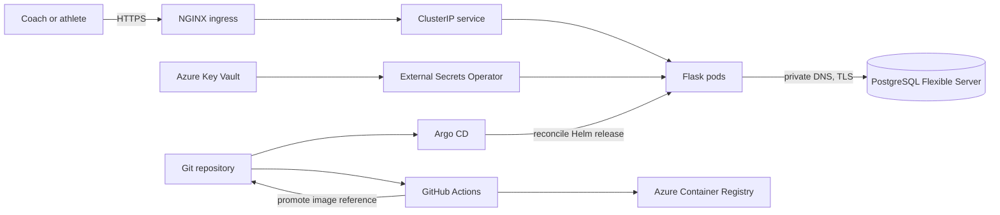

# Traditional Strength: platform engineering case study

## Executive summary

Traditional Strength is a powerlifting coaching product and a reviewable example
of operating a stateful web application on Azure Kubernetes Service (AKS). The
repository combines a Flask application, PostgreSQL migrations, Terraform,
Helm, Argo CD and GitHub Actions. Its strongest engineering theme is controlled
change: immutable releases, Git-owned desired state, migration gates, explicit
security boundaries and evidence that distinguishes declared configuration from
verified runtime behaviour.

This case study is based only on repository code, tests, workflows and history.
It does not claim current access to, or health of, any live environment.

## Architecture overview

Terraform is split into shared infrastructure and AKS roots. The separation
limits the blast radius of cluster changes, at the cost of an explicit
coordination boundary between states. AKS separates system services from the
coaching workload with System and User node pools. The application runs behind
NGINX with health probes, resource constraints, a disruption budget, restrictive
container security settings and network policies. PostgreSQL uses private
networking and managed backups; its credentials are referenced from Kubernetes
Secrets rather than stored in Helm values.

## AKS and GitOps deployment model

CI and delivery have deliberately separate responsibilities:

1. Pull-request workflows test application behaviour, render infrastructure and
   application definitions, and run security checks selected by path.
2. A release workflow builds a container and identifies it with the source Git
   commit SHA.
3. The promoted image reference is committed to the tracked production values
   or manifest.
4. Argo CD observes Git and reconciles the declared release with pruning and
   self-healing.
5. Migration hooks must succeed before the application rollout proceeds.

This makes Git the audit trail and rollback control surface. It also means Argo
CD is an operational dependency, and an emergency in-cluster change is only
temporary unless the desired state is subsequently corrected in Git. The
repository includes historical screenshots of a healthy, synchronized
application, but treats them as point-in-time evidence rather than proof of
current status.

## Incident story: dashboard history and observability

Repository history records a dashboard regression in which the executive view
could show the latest platform snapshot but did not have persisted history from
which to calculate trends. The repair connected collection to snapshot
persistence and added a test proving changes in platform score, health latency
and restart count were calculated from two stored observations. A follow-up
removed reliance on a standalone script and exposed ingestion through the
application's supported command interface, so the scheduled collector used the
same runtime and database initialization path as the application.

The broader SRE lesson was that a dashboard is not an observability system by
itself. The repository now makes conservative capability claims: shallow health
checks, container logs and Azure monitoring foundations are present, while the
Prometheus service monitor, alert rules and Grafana dashboard remain opt-in.
They are not described as production monitoring until instrumentation, scraping,
storage, query correctness, notification routing and ownership are proven end
to end. This avoids a particularly dangerous failure mode: a polished dashboard
creating confidence without actionable telemetry behind it.

## Incident story: migration graph drift and forward repair

The migration history also records schema-graph drift. Independently developed
Alembic revisions pointed at earlier parents, producing competing lines of
development. Focused commits corrected parent revisions and later linearized
programme-history and external-review migrations into one ordered chain. Tests
exercise upgrades on a clean database, schema verification and the expectation
of a single migration head; release evidence also fails when multiple heads are
reported.

The operational learning is to treat migration state as release state. The
candidate image runs the upgrade in a no-retry pre-deployment job, and failure
blocks rollout. Changes are designed to remain compatible with the previous
application during rolling overlap. If an additive migration partially commits,
the documented response is to inspect the real revision and schema, then ship an
idempotent forward repair. Manually changing the migration-version table or
automatically downgrading a database would hide evidence and can make data loss
worse. The repository documents that policy; it does not claim that a
forward-repair event has been exercised against production.

## CI/CD and release safety

The delivery system provides layered controls:

- Python unit, integration and route tests, plus Playwright browser journeys;
- Helm linting/rendering and Kubernetes manifest validation;
- Terraform formatting, offline validation, reviewed plans and Checkov;
- Trivy repository and image scanning, CodeQL and an SPDX software bill of
  materials;
- commit-pinned third-party workflow actions and short-lived GitHub-to-Azure
  OIDC authentication;
- separate runtime and migration secret references;
- concurrency controls around promotion workflows; and
- sanitized, local release-evidence generation with an operator checklist.

These are repository capabilities, not proof that external branch protection,
environment reviewers or every check is mandatory. The rollback path promotes a
known immutable image through Git after checking schema compatibility. Database
restore is a separate recovery decision, not an automatic response to a bad
application release.

## Multi-tenant SaaS security evolution

The product started with global user roles and athlete ownership checks. The
current repository adds organisation, membership, coach-to-athlete ownership,
invitation and subscription-account foundations with composite keys that keep
related membership records in the same organisation. It also contains explicit
cross-tenant negative-test contracts and a catalog-driven migration verifier.

The important assurance point is that this is an evolution, not a completed
claim. Several cross-tenant route tests are strict expected failures and state
that authenticated coaches can still have broader access than the target SaaS
model allows. The proposed end state uses organisation-qualified queries,
central policy decisions, composite foreign keys and PostgreSQL row-level
security, introduced through expand, compatible application, backfill, cutover,
constraint and retirement phases. Global identities are retained; no parallel
tenant model is introduced here.

Security is therefore framed as progressive defence in depth: authenticate,
resolve an active membership, check a named capability, query by organisation
and object identifier, validate coach ownership, and finally enforce the same
boundary in PostgreSQL. Negative tests remain visible so an incomplete boundary
cannot be mistaken for completed isolation.

## Measurable quality evidence

At this revision, static collection finds 115 Python test files containing 684
test functions and 15 Playwright specifications containing 68 test
declarations. The tests cover authentication, authorization, coaching
workflows, migration sequencing, release evidence, security configuration,
dashboard behaviour and browser journeys. These counts describe the committed
suite; they are not a pass-rate or coverage percentage.

Quality is assessed at several layers rather than through one headline metric:
domain and route tests for application behaviour, negative security contracts,
clean-database migration tests, rendered-manifest assertions, infrastructure
validation, vulnerability analysis and browser-level user journeys. A local
release-evidence tool combines relevant results and intentionally reports
missing or stale inputs as not ready rather than silently passing.

## Technical decisions and trade-offs

| Decision | Benefit | Accepted cost or limitation |
| --- | --- | --- |
| GitOps reconciliation | Auditable desired state, drift correction and deterministic image selection | Argo CD and Git availability become operational concerns |
| Commit-SHA image references | Source-to-runtime traceability and unambiguous rollback target | Less readable than semantic release labels |
| Separate Terraform roots | Smaller infrastructure change domains | Explicit coordination between shared and AKS state |
| Dedicated AKS workload pool | Separates application capacity from cluster services | Additional pool capacity and quota management |
| Private managed PostgreSQL | Managed backup and reduced public exposure | Single-region, non-HA configuration reflects cost and recovery trade-offs |
| External Secrets with workload identity | No application secret values in Git and no long-lived cloud credential in CI | Adds a controller dependency; synchronized values still exist as Kubernetes Secrets |
| Migration-gated rollout | Prevents a new binary from starting on an old schema | Requires backward-compatible migrations and disciplined forward repair |
| Deferred metrics stack activation | Avoids claiming an unverified monitoring path | Current telemetry remains limited and no formal SLO or error budget is evidenced |
| Shared-database tenancy design | Efficient operations and consistent global identity | Isolation requires pervasive query, constraint, role and RLS controls before it is complete |

## Relevance to Platform, DevOps and SRE roles

This platform demonstrates the ability to design and review a complete delivery
path rather than only deploy a container. It connects infrastructure as code,
Kubernetes scheduling and security, secret delivery, immutable artifacts,
GitOps promotion, stateful migration safety, recovery decisions and testable
operational evidence.

For Platform Engineering, it shows reusable paved paths and explicit trust and
state boundaries. For DevOps, it shows traceable automation with security and
release gates. For SRE, it shows cautious observability claims, failure-domain
analysis, forward-repair thinking and an insistence that dashboards, backups
and manifests are not considered operational until their full paths are tested.
Just as importantly, the repository keeps limitations visible: single-region
operation, a single production replica during database cutover, unproven
database restore readiness, incomplete active alerting and unfinished tenant
isolation.

## Evidence trail

- [Architecture](architecture.md)
- [Operations and recovery](operations.md)
- [Security architecture](security.md)
- [Observability current state](observability-current-state.md)
- [Engineering decisions](engineering-decisions.md)
- [Migration sequencing](v7.9-migration-sequencing.md)
- [SaaS forward-migration runbook](v8-saas-forward-migration-runbook.md)
- [Known limitations](limitations.md)

